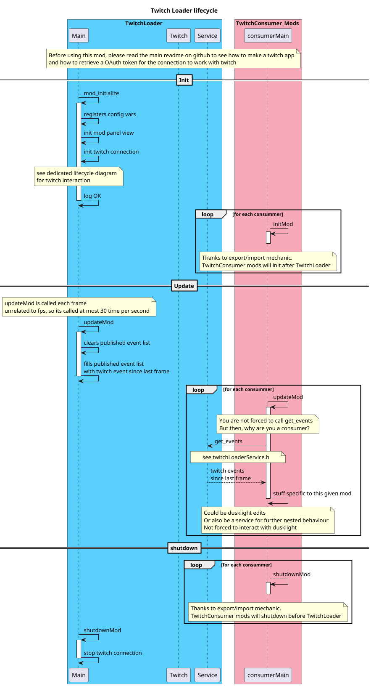

A mod by human for human, I do not like the usage of generative AIs. Also, we stand for Trans people right :3

# TwitchLoader Mod

A [Dusklight](https://github.com/TwilitRealm/dusklight) mod. Provides a service to link dusklight with twitch events
(with oauth token and with websockets) to be used as a service for other mod.


This is how the mod works, I hope it is clear c: In itself, this mod does nothing to dusklight

## Quick start

See [mod-template](https://github.com/TwilitRealm/mod-template) for further documentation on modding

To use this mod, you need a Twitch OAuth token with those permissions

| Scope Name                                     | what for                      |
|------------------------------------------------|-------------------------------|
| bits:read                                      | Reading bit given by people   |
| channel:read:subscriptions                     | Retrieving a new sub info     |
| channel:read:redemptions                       | view the channel point reward |
| Not yet implemented ~channel:read:predictions~ | view predictions result       |
| moderator:read:followers                       | View new follower info        |
| user: read:chat                                | so you can mhhh read chat     |

Go to `https://dev.twitch.tv/console/apps/` and create an app there with whatever name you like.

redirect url: `http://localhost`

Game integration - Public

We now have a client id, it will be useful several times. Then you need to copy the client id in the following link so
it would look like ...?client_id=blablaNiceToken&redirect....

```
https://id.twitch.tv/oauth2/authorize?client_id=<CopyTere\>&redirect_uri=http://localhost
&response_type=token&scope=user:read:chat+moderator:read:followers+channel:read:subscriptions+channel:read:
redemptions+bits:read
```

There you have to authorize the token, IT WILL LINK TO A FAILED CONNECTION WEBPAGE look at the url

```
http://localhost/#access_token=<CopyThis\>&scope=user%253Aread...
```

We need to keep the access token, it is the OAuth token you must fill in the mod panel options. You also need the client
id (right now it is not user-friendly to find it)

## Building

As of right now, I work on linux with distrobox, ubuntu v24, since most tutorial will be ubuntu compliant. Sorry fellow
people on mac and windows, I might update this later. (It could be as straightforward as following dusklight main
documentation for building and then adapting the few more needed here)

   ```sh
   distrobox create -i ubuntu:24.04 -n ubuntu-box
   distrobox enter ubuntu-box
   
   # Follow dusklight main repo documentation
   
   # then for building this mod specifically, it needs libraries to communicate with websocket in ssl
   sudo apt install libboost-dev libboost-system-dev libssl-dev install nlohmann-json3-dev

   # and then simply build it :)
   cmake -B build
   cmake --build build
   ```

## Disclaimer

I am using [Boost's beast library](https://github.com/boostorg/boost) for the websockets and I have absolutely no clue
how license works, please do tell me if I'm doing anything forbidden. Also, feel free to use this mod as a base for
twitch integration.

I like sequence diagrams, they help to properly visualize behaviors of what's happening in the code.

Be silly, coding is (should be) a fun activity, put funny comments, spaces, clear code.

## TODOs

Not in a particular order

- First line <:
- Rename variable with same convention (Snake case). I used camelCase as a reflex from Java
- Clarifies the mod versionning convention
- Explain how to setup the twitch client id and retrieve auth token (could it be automated via twitch API ?)
- properly consider other websocket events (the reconnect one first I believe)

## My other mods to be used with TwitchLoader

[Demo mod](https://github.com/Noaseto/TwitchConsumer_Demo): To see how another mod interacts with it, it is minimalistic and has basic feature when typing in chat, having a follow or a sub.

### Coming later

[Twitch chat in dusk](https://github.com/Noaseto/TwitchConsumer_TwitchChat)

## Anything else

I am open to suggestions, questions, feel free to ask with an issue. It is possible that I forgot stuffs, it will come
at a later date :>
