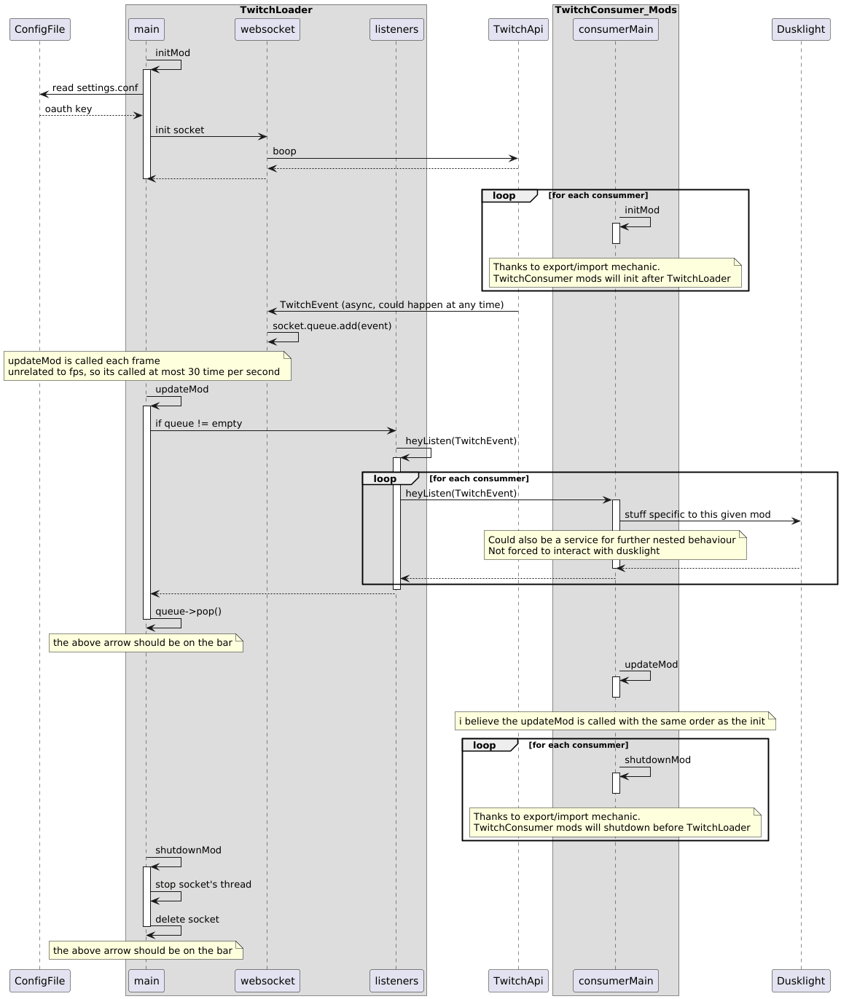

A mod by human for human, I do not like the usage of generative AIs. Also, we stand for Trans people right :3

# TwitchLoader Mod

A [Dusklight](https://github.com/TwilitRealm/dusklight) mod.
Provides a service to link dusklight with twitch events (with oauth token and with websockets) to be used with others for gameplay 


This is approximately how I see TwitchLoader and how others go with it.

Must read the [export service documentation](https://github.com/TwilitRealm/dusklight/blob/main/docs/modding.md#exporting-services) before doing more on the diagram

There is a video of what it's doing at the moment in docs, I need to clean the code and remove the get started of Boost's beast that exists on my machine. Please note that the fact twitch is interacting with dusklight is not the behavior intended, and I should have 2 mods for the exact same behavior.

## Quick start

See [mod-template](https://github.com/TwilitRealm/mod-template) for further documentation on modding

need a Twitch OAuth token with those permissions
|Scope Name|what for|
|-|-|
|bits:read|Reading bit given by people|
|channel:read:subscriptions|Retrieving a new sub info|
|channel:read:redemptions|view the channel point reward|
|Not yet implemented ~channel:read:predictions~|view predictions result|
|moderator:read:followers|View new follower info|
|user:read:chat|so you can mhhh read chat|

https://dev.twitch.tv/console/apps/
create an app there with whatever name you like
redirect url : http://localhost
Game integration - Public

We now have a client id, it will be useful several times.
Then you need to copy the client id in the following link and remove < and > so it would look lik
...?client_id=blablaNiceToken&redirect....

https://id.twitch.tv/oauth2/authorize?client_id=<CopyTere\>&redirect_uri=http://localhost&response_type=token&scope=user:read:chat+moderator:read:followers+channel:read:subscriptions+channel:read:redemptions+bits:read

There you have to authorize the token, IT WILL LINK TO A FAILED CONNECTION WEBPAGE
look at the url
http://localhost/#access_token=<CopyThis\>&scope=user%253Aread...
we need to keep the access token, it is the oauth you must fill in the mod (right now its not user friendly to fill it in)
you also need the client id

both to be copied in the res/twitch_credentials.config file

## Building

As of right now, I work with linux with distrobox, ubuntu v24, since most tutorial will be ubuntu compliant. Sorry fellow people on mac and windows, I might update this later.
(It could be as straightforward as following dusklight main documentation for building and then adapting the few more needed here)

   ```sh
   distrobox create -i ubuntu:24.04 -n ubuntu-box
   distrobox enter ubuntu-box
   
   # Follow dusklight main repo documentation
   
   # then for building this mod specifically, it needs libraries to communicate with websocket in ssl
   sudo apt install libboost-dev libboost-system-dev libssl-dev install nlohmann-json3-dev

   # and then simply build it :)
   cmake -B build
   cmake --build build
   ```

## Disclaimer

I am using [Boost's beast library](https://github.com/boostorg/boost) for the websockets and I have absolutely no clue how license works, please do tell me if I'm doing anything forbidden. Also, feel free to use this mod as a base for twitch integration.
I like sequence diagrams, they help to properly visualize behaviors of what's happening in the code.

## TODOs

- First line
- clear the code of all the example and be as concise as possible (the template is still there)
- create sequence diagrams for what I expect of this mod to become
- define a convention for versioning of the mod (most probably x.y.z : x major and breaks the service contract, y minor no modification of naming functions nor main behavior, z hotfixes typo etc)
- explain how to setup the twitch client id and retrieve auth token (could it be automated via twitch API ?)

## My other mods to be used with TwitchLoader

The first one will simply be notifications and a proof of concept for what can be achieved.
[Twitch chat in dusk](https://github.com/Noaseto/TwitchConsumer_TwitchChat) (i want for it to have a transparant window, this is not yet)

## Anything else 

I am open to suggestions, questions, feel free to ask with an issue.
It is possible that I forgot stuffs, it will come at a later date :>